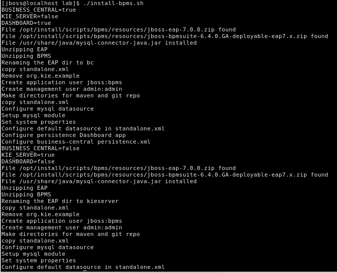
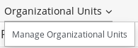

# Environment Setup Instructions
# Laboratory Virtual Machine
In this section you install the course VirtualBox virtual machine on your local workstation.

## Acquire
Download rhte-process-driven-apps.vdi directly from: https://drive.google.com/open?id=0B8mmXW6hJKdiY3plcThWbzBCakk.
## VM Operating System Credentials
* The default username/password for the VM is jboss/jboss.
* The jboss operating system user has sudo access.
## Install
1. Start VirtualBox on your local workstation and navigate to: **Machine** → **New**.
2. In the Create Virtual Machine panel, populate its fields:
  * **Name**: rhte-process-driven-apps
  * **Type**: Linux
  * **Version**: Red Hat (64-bit)
3. Click Next.
4. In the Memory panel, specify 4096 MB of RAM and click Next.
5. In the Hard Disk panel:
  * Select Use an existing virtual hard disk file.
  * Browse your hard drive and select the previously downloaded rhte-process-driven-apps.vdi image.
  * Click Create.
6. Click Start.
7. Accept the Operating System installation license and finish the installation.
8. The virtual machine should start and display the MATE window manager login.
  * Enter a userId of jboss and a password of jboss.
9. **Recommended**: Enable Virtual Box Guest Additions so as to leverage the full display resolution of your host machine.
## VM Components
The rhte-process-driven-apps.vdi VM image has these characteristics:

* VirtualBox 64-bit VDI format, built with VirtualBox version 5.1.28
* Operating system: CentOS 7
* Graphical environment: MATE
* Java JDK: OpenJDK 8
* Maven version 3.2.5
* MariaDB version 5.5.x
* Installed applications:
  * Red Hat JBoss BPM Suite 6, configured to use MariaDB as database and Quartz for timer management

# Explore Business Central and KIE Server
The VM comes with a script to install and configure the following BPM Suite components:
1. Business Central (in an EAP instance hosted in the filesystem folder `~/lab/bpms/bc`)
2. Dashbuilder (in an EAP instance hosted in the filesystem folder `~/lab/bpms/bc`)
3. KIE Server (in an EAP instance hosted in the filesystem folder `~/lab/bpms/kieserver`)

The KIE Server is configured as a managed KIE Server and Business Central is configured as the Workbench Controller for the manged KIE Server topology.

# Install JBoss BPM Suite
In this section you will install the JBoss BPM Suite instances.
1. In the VM, open a terminal window.
2. Ensure that you are logged in as `jboss` and change to `~/lab` directory.
3. Review the `install-bpms.sh` script:
  * Note that the script itself delegates to the `install-bpms-instance.sh` script in the `/opt/install/scripts/bpms` directory.
  * Note that the script creates:
    * An instance of JBoss BPM Suite Business Central at: `/home/jboss/lab/bpms/bc`
    * An instance of JBoss BPM Suite KIE Server at: `/home/jboss/lab/bpms/kieserver`
4. Execute the `install-bpms.sh` script.
  ```bash
  ./install-bpms.sh
  ```
5. Expect the script to complete with out errors.
  

# Start Business Central, KIE Server and Log in to Business Central
1. Open a terminal window and change to the `~/lab/bpms/bc/bin` directory and run the `./standalone.sh` script.
  ```bash
  cd ~/lab/bpms/bc/bin
  ./standalone.sh
  ```
  * The script starts the business central EAP instance.
  * keep the terminal window open for the duration of the lab.
  * In the log verify that you see the following, which indicates successful start:
  ```
  06:38:24,751 INFO  [org.jboss.as] (Controller Boot Thread) WFLYSRV0025: JBoss EAP 7.0.0.GA (WildFly Core 2.1.2.Final-redhat-1) started in 75748ms - Started 1329 of 1594 services (422 services are lazy, passive or on-demand)
  ```
2. In another terminal window or tab: change to the `~/lab/bpms/kieserver/bin` directory and run the `./standalone.sh` script.
  ```bash
  cd ~/lab/bpms/kieserver/bin
  ./standalone.sh
  ```
  * The script starts the KIE Server EAP instance.
  * keep the terminal window open for the duration of the lab.
  * In the log verify that you see the following, which indicates successful start:
  ```
  06:38:24,751 INFO  [org.jboss.as] (Controller Boot Thread) WFLYSRV0025: JBoss EAP 7.0.0.GA (WildFly Core 2.1.2.Final-redhat-1) started in 75748ms - Started 1329 of 1594 services (422 services are lazy, passive or on-demand)
  ```
  * In the business central log you see the following, which indicates successful connectivity between workbench controller and KIE Server:
  ```
  06:42:54,859 INFO  [org.kie.server.controller.impl.KieServerControllerImpl] (default task-1) Server http://127.0.0.1:8230/kie-server/services/rest/server connected to controller
  06:42:54,859 INFO  [org.kie.server.controller.rest.RestKieServerControllerImpl] (default task-1) Server with id 'kie-server-127.0.0.1' connected
  ```
3. Open a browser, and navigate to JBoss BPM Central: `http://localhost:8080/business-central`.
4. Log in with the `jboss/bpms` username/password.

# Create the Acme organization
1. Open a browser, and navigate to JBoss BPM Central: `http://localhost:8080/business-central`.
2. Log in with the `jboss/bpms` username/password.
3. Select the **Authoring**>**Administration** menu option.

  
4. From the **Organizational Units** menu select the **Manage Organizational Units** option.

  
5. Add an organization with the following information:
  * **Name:** Acme
  * **Default Group Id:** org.acme
  * You can leave the `owner` empty.
